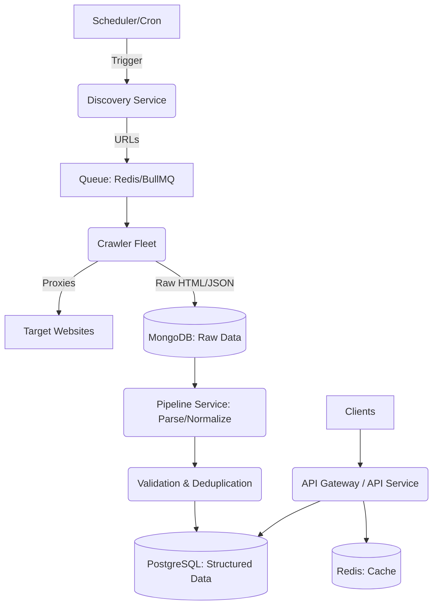

# CineGalaxy: Global Entertainment Intelligence Platform


## Overview
**CineGalaxy** is an enterprise-grade entertainment intelligence platform that aggregates movie, cinema, TV show, streaming, and entertainment information from thousands of websites worldwide. Designed to simulate a real-world company operating in 100+ countries, this system manages the entire lifecycle of data from discovery to API delivery.

---

## 1. Business Requirements
- **Global Coverage:** Aggregate data from over 100 countries, respecting local languages, censorships, and regional release dates.
- **Data Monetization:** Expose highly available APIs for B2B clients (streaming platforms, media outlets, global cinema chains).
- **High Freshness:** Cinema showtimes and streaming availability must be updated near real-time or daily.
- **Scalability & Reliability:** System must handle scraping millions of pages daily without IP bans or data corruption.

## 2. Functional Requirements
- **Discovery & Crawling:** Automatically discover new entertainment content and crawl thousands of target websites.
- **Scraping & Parsing:** Support both static HTML scraping and dynamic SPA rendering.
- **Data Normalization & Validation:** Enforce strict typing and validate structured data against business rules.
- **Deduplication:** Merge records from multiple sources (e.g., IMDb, TMDb, local cinemas) into a single "Golden Record."
- **API Provisioning:** Serve normalized data via REST and GraphQL APIs.
- **Health Monitoring:** Real-time dashboards for crawler health, success rates, and system metrics.

## 3. Architecture

The system is built on a distributed microservices architecture using TypeScript, Node.js, and a polyglot persistence strategy.



## 4. Folder Structure

We utilize a Monorepo approach using **TurboRepo** or **Nx** to share types, configurations, and utilities across microservices.

```text
cinegalaxy/
├── apps/
│   ├── api-service/          # Express/Fastify API
│   ├── crawler-service/      # Playwright/Cheerio scraping fleet
│   ├── pipeline-service/     # Data normalization, validation, dedup
│   └── scheduler-service/    # Cron jobs and queue producers
├── packages/
│   ├── database/             # Prisma/TypeORM schemas and migrations
│   ├── config/               # Shared ESLint, TSConfig
│   ├── types/                # Shared TypeScript interfaces & Zod schemas
│   └── logger/               # Winston/Pino logger setup
├── infrastructure/           # Terraform, Kubernetes Manifests, Helm Charts
├── docker-compose.yml
└── package.json
```

## 5. Scraping Framework

- **Dynamic Content:** **Playwright** is used for heavily obfuscated or JS-rendered websites. We implement stealth plugins to bypass basic bot detections.
- **Static Content:** **Cheerio** combined with standard HTTP clients (Axios/Got) for high-speed, low-footprint scraping of static pages.
- **Manager:** A dynamic routing layer decides whether a target requires Playwright or Cheerio based on past success rates and site configurations.

## 6. Data Pipeline

1. **Ingestion:** Crawlers push raw HTML/JSON payloads into MongoDB.
2. **Extraction:** DOM parsing using Cheerio to extract JSON-LD, metadata, and raw text.
3. **Normalization:** Translating site-specific formats (e.g., dates, currencies, languages) into standardized ISO formats.
4. **Validation:** Using **Zod** to validate the normalized payload against predefined schemas.
5. **Deduplication:** Entity resolution logic merges new data with existing PostgreSQL records.

## 7. Queue System

Built on **Redis** and **BullMQ**, the queue system orchestrates the asynchronous workflow:
- `discovery_queue`: URLs to be analyzed for deeper crawling.
- `scrape_queue`: Actual scraping tasks with priority levels (e.g., showtimes = high priority, historical movies = low priority).
- `parse_queue`: Raw data ready to be parsed.
- `dlq` (Dead Letter Queue): Failed jobs that exceeded retry limits, requiring manual inspection.

## 8. Database Design

**Polyglot Persistence Strategy:**
- **PostgreSQL:** Relational data with strict integrity.
  - Tables: `movies`, `shows`, `cinemas`, `showtimes`, `platforms`, `genres`.
- **MongoDB:** Unstructured/Semi-structured raw data.
  - Collections: `raw_scrapes`, `proxy_logs`, `crawler_metrics`.
- **Redis:**
  - Fast-access cache for API endpoints.
  - Job queues (BullMQ).
  - Rate limiting counters.

## 9. API Design

Built with **Fastify** for maximum throughput.
- **RESTful Endpoints:**
  - `GET /api/v1/movies?country=US&release_date=2023`
  - `GET /api/v1/cinemas/:id/showtimes`
- **GraphQL:**
  - Provided for complex client queries (e.g., querying a movie, its cast, and all cinema showtimes in London in a single request).
- **Authentication:** JWT-based API keys for B2B clients.

## 10. Monitoring

- **Prometheus & Grafana:** For infrastructure and application metrics (CPU, Memory, API latency).
- **Custom Scraping Metrics:**
  - Success vs. Failure rates per domain.
  - Proxy ban rates / CAPTCHA encounters.
  - Data payload size anomalies.
- **Logging:** Structured JSON logging using **Pino**, aggregated in an ELK Stack (Elasticsearch, Logstash, Kibana) or Datadog.

## 11. Testing

- **Unit Testing:** Jest for business logic, parsing rules, and normalization functions.
- **Integration Testing:** Testcontainers to spin up ephemeral Postgres/Redis instances to test pipeline flow.
- **E2E Testing:** Playwright to test API endpoints and sample scraping workflows.

## 12. Deployment

- Containerized using **Docker**.
- Orchestrated via **Kubernetes (K8s)**.
- Infrastructure as Code (IaC) using **Terraform** (AWS EKS, RDS, ElastiCache).

## 13. Scaling

- **Horizontal Pod Autoscaling (HPA):** Crawler pods scale up and down dynamically based on `scrape_queue` depth.
- **Database Scaling:** PostgreSQL uses read replicas for heavy API read traffic.
- **Caching Layer:** Redis cluster to offload DB queries for highly requested data (e.g., current box office hits).

## 14. Error Recovery

- **Dead Letter Queues (DLQ):** Failed jobs are sent here after maximum retries.
- **Circuit Breakers:** Prevent cascading failures when third-party endpoints or target websites go offline.
- **Graceful Degradation:** APIs serve cached data if the underlying database is temporarily unreachable.

## 15. Rate Limiting

- **Inbound (API):** Redis-based Token Bucket algorithm to throttle client requests based on their subscription tier.
- **Outbound (Scraping):** Domain-specific concurrency limits to avoid overwhelming target websites and getting IP banned.

## 16. Retry Strategies

- **Exponential Backoff with Jitter:** Applied to network timeouts and `5xx` errors.
- **Targeted Retries:** `429 Too Many Requests` triggers a pause on that proxy/domain pair. `403 Forbidden` triggers a proxy rotation and fingerprint change.

## 17. Proxy Management

- **Proxy Pool:** A mix of Datacenter, ISP, and Residential proxies.
- **Smart Routing:** Requests start with cheap Datacenter proxies; if blocked, they gracefully fall back to premium Residential proxies.
- **Health Scoring:** Proxies that repeatedly return blocks or CAPTCHAs are temporarily quarantined or retired.

## 18. Data Quality Validation

- **Zod Schemas:** Ensure non-null constraints, regex matching for IDs, and correct data types.
- **Anomaly Detection:** Flagging impossible scenarios (e.g., a movie released in 1800, a runtime of 4000 minutes) for manual review.
- **Completeness Metrics:** Monitoring the percentage of null fields in the parsed data.

## 19. Multi-Country Support

- **Geo-Targeting:** Injecting `Accept-Language` headers and using country-specific proxies to bypass region locks and scrape localized content.
- **i18n Schema:** Storing arrays of localized titles, synopses, and release dates tied to ISO country codes.
- **Timezones:** Storing all showtimes in UTC and converting at the API layer based on the cinema's geolocation.

## 20. CI/CD

- **GitHub Actions:**
  - PR checks: ESLint, Prettier, TypeScript compilation, Unit Tests.
  - Merge to Main: Build Docker images, tag with Git SHA, push to AWS ECR.
  - Deploy: Update Helm charts to deploy the new images to the K8s staging environment.

## 21. Docker Setup

Example `Dockerfile` for the Crawler Service:
```dockerfile
FROM node:20-alpine AS builder
WORKDIR /app
COPY . .
RUN npm ci && npm run build

FROM mcr.microsoft.com/playwright:v1.40.0-jammy
WORKDIR /app
COPY --from=builder /app/dist ./dist
COPY package*.json ./
RUN npm ci --only=production
CMD ["node", "dist/apps/crawler-service/main.js"]
```

## 22. Kubernetes Deployment

Key K8s constructs used:
- **Deployments:** For scalable stateless services (API, Pipeline).
- **StatefulSets:** For databases and Redis (if hosted inside cluster, though managed services are preferred).
- **KEDA (Kubernetes Event-driven Autoscaling):** To scale crawler pods based on Redis BullMQ metrics.
- **ConfigMaps & Secrets:** To manage environment variables and proxy credentials securely.

## 23. Interview Discussion Topics

To showcase your architectural mastery, be prepared to discuss:

1. **Anti-Bot Evasion:** *"How did you handle Cloudflare, Datadome, or Akamai? Tell me about TLS fingerprinting (JA3) and headless browser detection."*
2. **Entity Resolution:** *"How do you know that 'The Dark Knight (2008)' from Site A is the exact same movie as 'Dark Knight, The' on Site B?"* (Discuss fuzzy string matching, Levenshtein distance, exact matches on IMDB IDs).
3. **Queue Bottlenecks:** *"What happens if your Redis queue runs out of memory because parsing is slower than scraping?"* (Discuss backpressure, TTL, and scaling workers).
4. **Data Consistency:** *"How do you handle schema migrations in PostgreSQL with zero downtime?"*
5. **Proxy Economics:** *"Residential proxies are expensive. How did you optimize your scraping paths to minimize proxy costs?"*

---

### Implementation Roadmap

- **Phase 1: Foundation (Weeks 1-2)** - Setup Monorepo, DB schemas, Docker, and BullMQ.
- **Phase 2: Scraping Core (Weeks 3-5)** - Implement Playwright/Cheerio crawlers, proxy rotation, and MongoDB ingestion.
- **Phase 3: Data Pipeline (Weeks 6-8)** - Build parsing, Zod validation, and deduplication logic.
- **Phase 4: API & Delivery (Weeks 9-10)** - Develop Fastify REST/GraphQL APIs and Redis caching.
- **Phase 5: Infrastructure (Weeks 11-12)** - Deploy to Kubernetes, setup Prometheus monitoring, and CI/CD pipelines.
